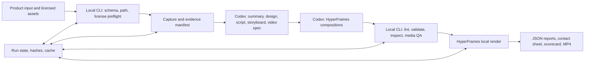

# MVP Architecture

## 决策

首版采用本地 HyperFrames-first 工作流。创意判断由 Codex 完成，CLI 只执行可重复、可记录的确定性步骤。这样能单独验证品牌表达、素材证据、composition 质量和本地渲染可靠性，同时避免把云架构或第二套 Agent 系统引入 MVP。

## Responsibilities

| Area | Owner | Observable output |
|---|---|---|
| Product facts and message | Codex | `PRODUCT-SUMMARY.md`, claim/evidence map |
| Brand and creative direction | Codex | `DESIGN.md`, `SCRIPT.md`, `STORYBOARD.md` |
| Scene contract and visual implementation | Codex | `video-spec.json`, HyperFrames compositions |
| Validation and orchestration | Local CLI | nonzero failures, `run-state.json`, structured JSON reports |
| HTML animation and render | HyperFrames 0.8.33 | lint/validate/inspect evidence, draft/final MP4 |
| Media verification | FFprobe/FFmpeg plus independent visual review | media checks, contact sheet, QA report, scorecard with explicit reviewer type |

The CLI does not generate creative content, call Codex, or hide external service calls. HTML compositions remain the visual source of truth.

## Local provider boundary

- Capture: local HyperFrames `capture`, with automatic `supplied-assets` fallback; `--supplied-only` skips URL capture.
- Narration: verified HyperFrames TTS, authorized `external-audio`, or `none`.
- Render: `hyperframes-local`.
- Storage: local filesystem.

Retries are bounded and stage-specific. The `--resume` flag applies to capture, verify-input, QA, render and full run; init recognizes identical input and asset bytes idempotently. Cache reuse requires matching input/dependency hashes and unchanged output hashes; changed creative artifacts or source assets invalidate their dependent stages. JSON reports record the command, exit code, duration, paths, and remaining risk observed in the current run. Warning reviews match each finding's file, severity, code, message and snippet one to one; unexplained findings block QA.

## Security and rights

The workflow never bypasses login, CAPTCHA, paywalls, anti-bot controls, or access restrictions. It excludes secrets, cookies, private data, and full environment dumps from reports. Only assets marked `owned` or `authorized` may enter a final render.

Cloud services and multi-renderer operation are deferred to [SCALE-GATE.md](SCALE-GATE.md); that document defines criteria and interfaces only.
