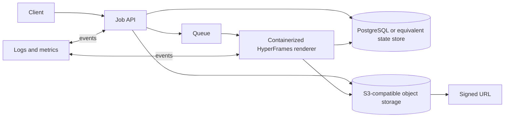

# Scale Gate

## Decision rule

保持本地架构，直到下面七项中至少两项有连续、可审计的运行数据证明成立。单次峰值、预期增长或“以后可能需要”不构成扩容依据。

1. 连续两个月每月至少 50 条成功成片，或单月达到 100 条；
2. 峰值至少 5 个生成任务/天，且本地队列等待时间 `p95 > 20` 分钟；
3. 每条视频用于纯编排和重复操作的人工耗时中位数超过 15 分钟；
4. 失败恢复或重复运行比例超过 5%；
5. 本地素材与成片占用超过 50 GB；
6. 需要从网站、Webhook 或其他设备远程提交任务；
7. 需要多 renderer 并发、团队协作或明确 SLA。

在 `run-report.json` 中保留成功/失败、重试、等待、人工修改时间、渲染时间和磁盘占用等原始数据。是否越过门槛应由至少两个独立指标及其统计区间决定。

## Post-gate architecture (design only)

Proposed interfaces after the gate:

- `POST /jobs`: validates an input manifest, computes an idempotent job key, applies concurrency/budget limits, and returns a job ID.
- `GET /jobs/{id}`: returns stage state, attempts, timing, artifact metadata, and actionable failure details.
- `POST /jobs/{id}/retry`: retries only an eligible failed stage with a bounded attempt policy.
- Object manifest: stores input hashes, licensed asset metadata, render artifacts, and signed URL expiry without embedding credentials.
- Renderer lease: contains immutable spec/version hashes, timeout, resource budget, and heartbeat/expiry semantics.

The post-gate design requires a Job API, PostgreSQL or equivalent state store, queue, S3-compatible object storage, containerized HyperFrames renderer, signed URLs, idempotent job keys, stage retries, concurrency/budget limits, and logs/metrics.

## Explicit non-implementation

EPVS-MVP-001 does not create, provision, configure, or deploy any of these services. It adds no cloud SDK, database, queue, container platform, object store, remote endpoint, credential, paid API, or production environment change.
